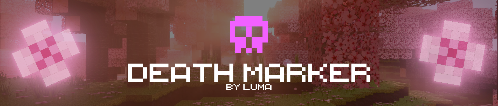

A lightweight, client-side Minecraft Fabric mod that helps you find your items after death by placing a marker at your death location.

## Features

- **Despawn Timer**: Shows exactly how much time is left before your items despawn (mimics Minecraft's 5-minute item timer).
- **Distance Tracking**: Displays the precise distance to your death location in meters.
- **Auto-Clear**: Naturally disappears once you reach your items.

## Configuration

If you have **ModMenu** and **Cloth Config** installed, you can customize almost everything:

- **Colors**: Change the color of the skull, timer, and distance text using a built-in color picker.
- **Behavior**: Adjust how close you need to be for the marker to clear or when it should start shrinking.

## Localizations

- **English** (en_us)
- **Русский** (ru_ru)
- **Українська** (uk_ua)

## Installation

1. Install [Fabric Loader](https://fabricmc.net/).
2. Drop the `deathmarker.jar` into your `mods` folder.
3. (Optional but Recommended) Install [Cloth Config API](https://modrinth.com/mod/cloth-config) and [ModMenu](https://modrinth.com/mod/modmenu) for configuration support.

---

_Created by [LumaBlossom](https://modrinth.com/organization/LumaBlossom)_
